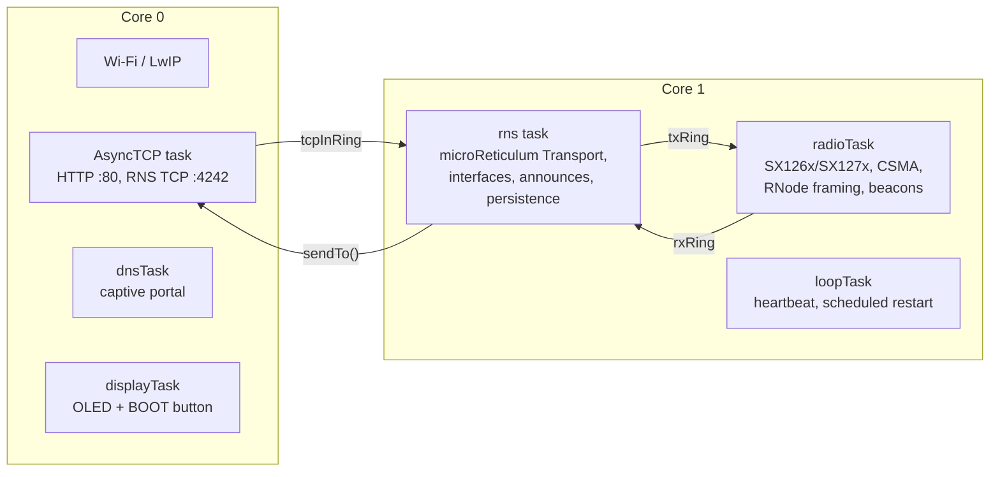
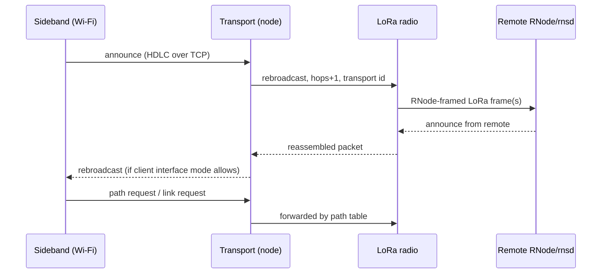

# Architecture

## One paragraph
An ESP32-S3 runs a Wi-Fi access point with a captive portal (HTTP :80) and a
Reticulum TCP server (:4242), a LoRa transceiver driver that speaks RNode's
on-air framing, and an embedded Reticulum stack (microReticulum) with
**transport enabled**. Every hardware path is an RNS interface with its own
mode; Transport decides what is forwarded where. Packet payloads are
end-to-end encrypted between Reticulum peers — the node routes, it never
reads.

## Tasks and cores

- **AsyncTCP task** only moves bytes: HDLC-deframes client streams into
  `tcpInRing` (tagged with the client id) and writes framed packets back.
- **radioTask** owns the transceiver: interrupt-driven RX, split-packet
  reassembly, CSMA and fragmentation on TX, live reconfiguration between
  packets, beacon/station-ID recognition.
- **rns task** owns microReticulum, which is single-threaded: it drains the
  rings into the interfaces (`handle_incoming`), runs Transport (forwarding,
  announce propagation, path requests, link tables) and its housekeeping
  every second, announces the node, and refreshes snapshots for the web UI.
- Ring buffers (`RINGBUF_TYPE_NOSPLIT`, one item = one packet) never block:
  overflow drops, because a stalled radio is worse than a lost packet.

## Packet flow

## Modules
| File | Responsibility |
|---|---|
| `main.cpp` | ring buffers, task layout, boot order |
| `Config.h` | defaults, pins, sizes, shared stats struct |
| `Settings.*` | NVS-backed runtime settings (radio, Wi-Fi, transport, admin) |
| `LoRaRadio.*` | RadioLib driver, auto-detect, RNode framing, CSMA, beacons |
| `RetiTransportServer.*` | TCP :4242, HDLC, per-client ids, announce bookkeeping |
| `RnsTransport.*` | microReticulum integration: interfaces, transport, announces, snapshots |
| `RnsFileSystem.h` | microStore adapter over LittleFS (`/rns`, never formats) |
| `RnsAnnounce.*` | node identity keys, announce parsing/verification for the neighbour table |
| `Neighbors.*` | table of stations heard (announces, station IDs, beacons) |
| `WifiManager.*` | SoftAP, captive DNS, web routes, settings API, restarts |
| `Display.*` | SSD1306 pages, button navigation, sleep |
| `HDLC.h` | RNS TCP framing |
| `data/` | web app (LittleFS): status page, settings page |

## Storage
| Where | What |
|---|---|
| NVS `retimesh` | settings (radio, Wi-Fi, transport, admin password) |
| NVS `retimeshid` | identity keys (kept across factory reset) |
| LittleFS `/` | `index.html`, `settings.html`, `board.json` |
| LittleFS `/rns` | Transport persistence: paths, known destinations, hash list, cache |

## Budgets (T3-S3, v0.0.3)
Flash 1.29 MB of 3 MB app partition · heap ~180 KB free steady · PSRAM 2 MB
mostly unused (reserved for future tables/buffers).
