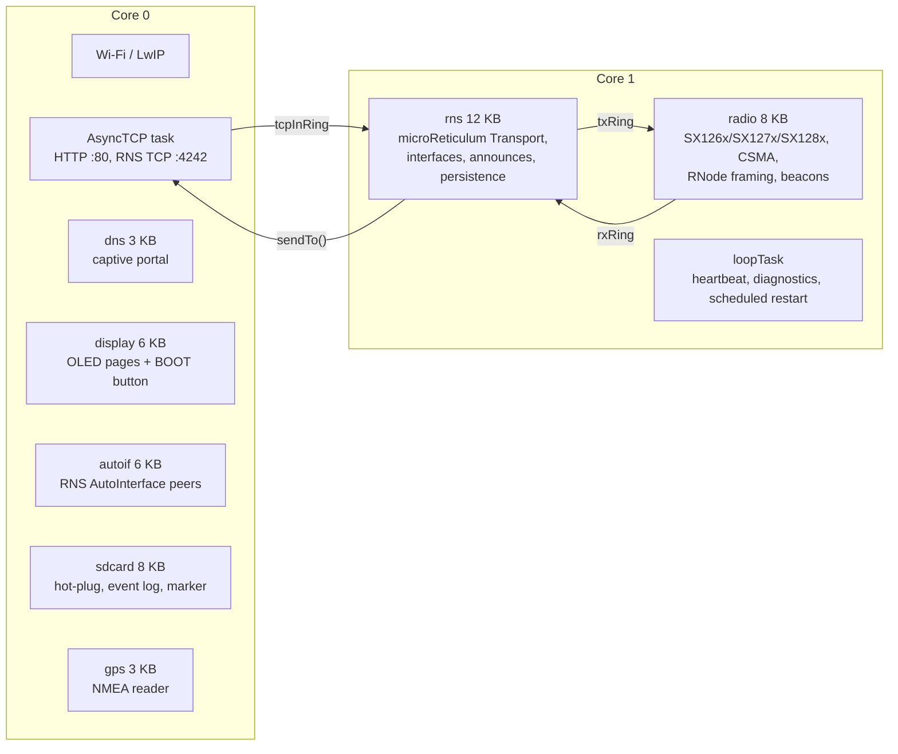
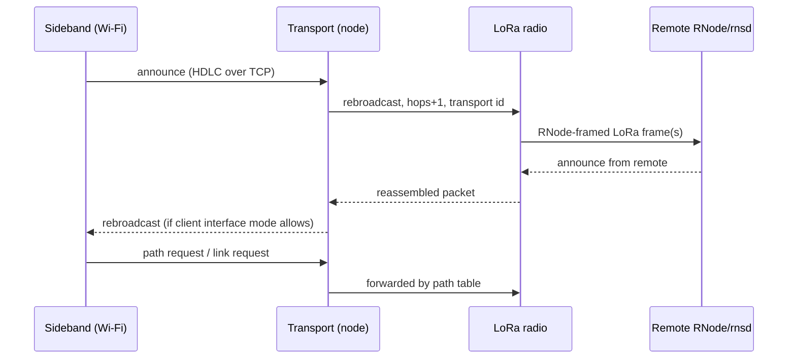

# Architecture

## One paragraph
An ESP32-S3 runs a Wi-Fi access point with a captive portal (HTTP :80) and a
Reticulum TCP server (:4242), a LoRa transceiver driver that speaks RNode's
on-air framing, and an embedded Reticulum stack (microReticulum) with
**transport enabled**. Every hardware path is an RNS interface with its own
mode; Transport decides what is forwarded where. Packet payloads are
end-to-end encrypted between Reticulum peers — the node routes, it never
reads.

## Tasks and cores

- **AsyncTCP task** only moves bytes: HDLC-deframes client streams into
  `tcpInRing` (tagged with the client id) and writes framed packets back.
- **autoif task** (core 0) speaks RNS AutoInterface: multicast discovery
  tokens, peer table with the 22 s timeout, UDP datagrams into the same
  ring tagged with the peer id; each peer is an RNS interface.
- **radioTask** owns the transceiver: interrupt-driven RX, split-packet
  reassembly, CSMA and fragmentation on TX, live reconfiguration between
  packets, beacon/station-ID recognition.
- **loopTask** runs the bootloader manager (every restart passes through it),
  the serial maintenance console and the local-link bookkeeping, a few bytes
  per 200 ms pass — see [local-link.md](local-link.md).
- **rns task** owns microReticulum, which is single-threaded: it drains the
  rings into the interfaces (`handle_incoming`), runs Transport (forwarding,
  announce propagation, path requests, link tables) and its housekeeping
  every second, announces the node, and refreshes snapshots for the web UI.
- Ring buffers (`RINGBUF_TYPE_NOSPLIT`, one item = one packet) never block:
  overflow drops, because a stalled radio is worse than a lost packet.

## Packet flow

## Modules

`src/` is one folder per unit. A file is included by its own name from
anywhere — every unit is on the include path (`platformio.ini`) — so the
folder says what a thing belongs to without putting the unit into sixty
`#include` lines. `Config.h` and `main.cpp` stay at the root because they
belong to no unit: one is the board's shape, the other is the boot order.

### `src/` — the root
| File | What |
|---|---|
| `main.cpp` | ring buffers, task layout, boot order |
| `Config.h` | defaults, pins, sizes, shared stats struct |
| `boards/` | one header per board: pins, capabilities, what it has |

### `src/radio/` — the LoRa side
| File | What |
|---|---|
| `LoRaRadio.*` | RadioLib driver, auto-detect, RNode framing, CSMA, beacons |
| `RadioCaps.*` | per-chip frequency, bandwidth, spreading-factor and power limits |
| `Airtime.*` | regulatory regime per region, duty cycle and dwell budget, airtime accounting |

### `src/net/` — how a host reaches the node
| File | What |
|---|---|
| `LocalLinkState.h`, `LocalLink.*` | the ways a host reaches the node: phase machine (pure), registry, adapters, local-address policy |
| `WifiManager.*` | SoftAP, station, web routes, settings and system API |
| `CaptiveDns.*` | the access point's resolver, and only the access point's |
| `UsbNcm.*` | the S3's composite USB device and the network link behind it |
| `PppArbiter.h`, `PppUart.*` | PPP over the bridge UART, sharing the port with the console |
| `ConsoleServer.*` | the maintenance console on TCP :4243, one caller at a time, authenticated |
| `LazyStart.h` | when a link built on demand may be built: the failure latch and the teardown gate, shared by PPP and USB-NCM (pure, unit-tested) |
| `RetiTransportServer.*` | TCP :4242, HDLC, per-client ids, announce bookkeeping |
| `HDLC.h` | RNS TCP framing (pure, unit-tested) |
| `Mdns.h` | node name to a legal DNS label (pure, unit-tested) |

### `src/rns/` — Reticulum
| File | What |
|---|---|
| `RnsTransport.*` | microReticulum integration: interfaces, transport, announces, snapshots |
| `RnsAnnounce.*` | node identity keys, announce parsing/verification for the neighbour table |
| `AutoInterface.*` | RNS AutoInterface: IPv6 link-local peering, multicast and unicast |
| `Neighbors.*` | table of stations heard (announces, station IDs, beacons) |
| `RnsFileSystem.h` | microStore adapter over LittleFS or SD (`/rns`, never formats) |

### `src/ui/` — what the node shows
| File | What |
|---|---|
| `Display.*` | the pages, button navigation and sleep — drawn through `Panel`, so the same page code serves any panel |
| `Panel.h` | what a panel has to offer a page: a canvas, a flush, and what its ink costs |
| `OledPanel.*` | SSD1306 over I2C |
| `EinkPanel.*` | 2.13" e-paper, whose update costs hundreds of milliseconds and whose image survives power off |
| `RefreshPolicy.h` | whether a drawn frame is worth pushing to the glass, and how (pure, unit-tested) |
| `DisplayLayout.h` | panel geometry and refresh cost, per board |
| `DisplayIcons.h` | procedural glyphs, sized at the call site |
| `Leds.*` | what the board's LEDs say: dark is normal, lit is worth a glance |
| `QrCode.*` | join/portal/address codes for the portal and panel |

### `src/sys/` — the node's own housekeeping
| File | What |
|---|---|
| `Settings.*` | NVS-backed runtime settings (radio, Wi-Fi, transport, links, admin) |
| `SettingsRules.h` | what a settings value may be — one home, shared by the API and the console (pure, unit-tested) |
| `SettingsFields.*` | every setting by name, for the console's `GET`/`SET` |
| `MaintenanceProtocol.h`, `Maintenance.*` | the maintenance console: line protocol (pure), commands, and one session per way in — the cable and the socket are served in the same pass |
| `BootloaderPlan.h`, `Bootloader.*` | every restart: request → quiesce → restart; software entry into the ROM downloader on S2/S3/C3 |
| `Diag.*` | reset reason, boot counter, previous run length, per-task stack headroom, heap and DRAM |
| `StoreHome.*` | where the Reticulum store lives, the card's ownership marker, and moving it |
| `SdCard.*` | slot polling, capacity and filesystem detection, FAT32 format, event log |
| `Power.*`, `Pmu.*` | CPU/Wi-Fi/display profiles; battery via PMU or ADC divider |
| `Gps.*` | NMEA reader, fix and satellite count, receiver power rail |

### Outside `src/`
| Where | What |
|---|---|
| `data/` | web app (LittleFS): status page, settings page |

## Storage
| Where | What |
|---|---|
| NVS `retimesh` | settings (radio, Wi-Fi, transport, links, maintenance, admin password) |
| NVS `retimeshid` | identity keys (kept across factory reset) |
| NVS `retimesh-diag` | boot counter |
| LittleFS `/` | `index.html`, `settings.html`, `board.json`, `assets.json` |
| LittleFS `/rns` **or** SD `/rns` | the Reticulum store: paths, known destinations, hash list, cache |
| SD `/retimesh/events.log` | rolling event log, downloadable from the portal |
| SD `/retimesh/store.json` | which node owns the store on this card |

### The store has one home
The store lives in exactly one place at a time: the card when one has been
taken into use, internal flash otherwise. Never both — two live copies of the
same path table, each being written, is two answers to one question with no way
to tell which is right.

`StoreHome` owns that rule. Where the store belongs is one pure function of
three facts (the setting, whether a card is mounted, and what the card holds),
so it is unit-tested rather than only observable by booting a node with a card
in it.

**Moving it** is a copy, not a flag. Adopt and eject record the request, restart,
and perform the move early in boot, before the web server, the card task or the
store itself exist — the underlying stores hold their files open for their
lifetime, so nothing may be reading them while they move. The copy is staged
beside the destination and verified before anything is deleted, so a failure at
any point leaves a readable store at one end or the other.

**Ownership.** A card holding a store is indistinguishable from a card holding
somebody else's, so the owner writes its identity onto the card. A node then
recognises its own card, refuses one belonging to another node, and takes one
whose previous owner released it. Matching is on the node's identity, not its
name, so renaming a node never costs it its store — but a factory reset that
regenerates the identity does, and the card must then be formatted before it can
be used again.

### Partition tables
`huge_app.csv` (3 MB app, 896 KB filesystem) on 4 MB boards. The 8 MB boards use
`partitions/huge_app_8mb.csv`, which is the same up to the end of the
application and gives the four megabytes the stock table leaves unmapped to the
filesystem instead. That matters most where there is no SD slot, because the
filesystem is then the only home the store has: 4900 KB of room rather than
896 KB.

## Memory (T3-S3)
Flash 1.38 MB of the 3 MB app partition. Internal RAM is the scarce
resource: the core routes only `malloc()` > 4 KB to PSRAM by default and
nothing here is that large, so the firmware lowers the threshold to
`PSRAM_MALLOC_THRESHOLD` (128 B) at boot and places the ring-buffer storage
in PSRAM explicitly. Result with transport, AutoInterface, mDNS and SD on:
**~200 KB internal free (min ~200 KB)** and ~90 KB in PSRAM, versus ~160 KB
internal before. ISR code never allocates, so PSRAM-backed heap is safe;
Wi-Fi/lwIP keep their own internal pools. `/api/status` reports
`heap_free` (internal), `heap_min_free` and `psram_free`.
