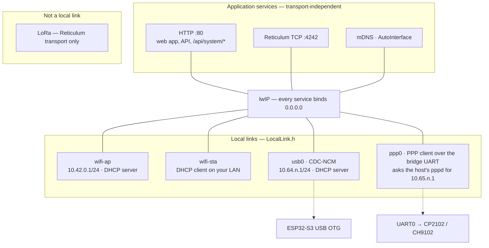
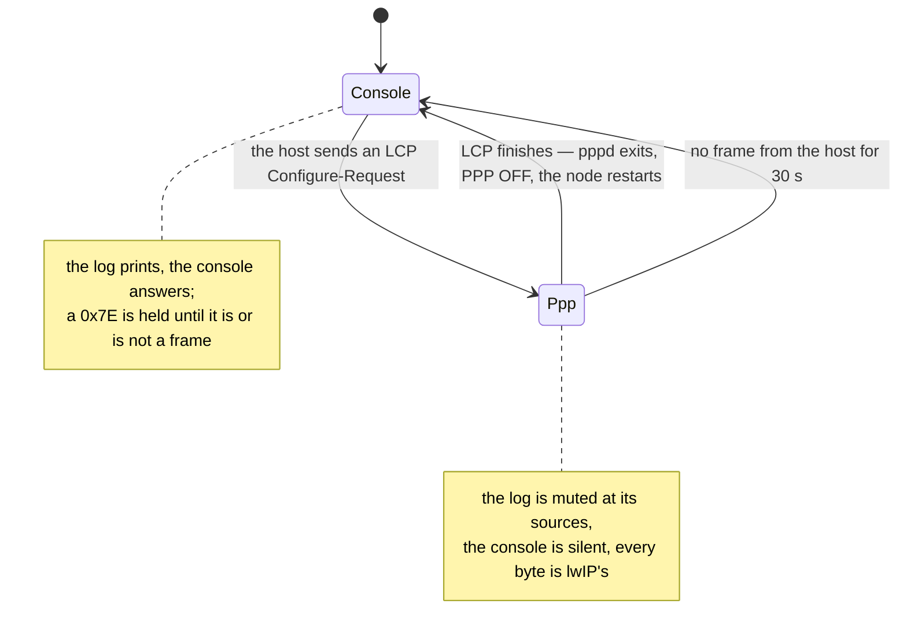

# Local links, the maintenance console and the bootloader manager

A *local link* is a way a host computer reaches the node directly: the Wi-Fi
access point, the station uplink, the chip's own USB carrying IP (CDC-NCM), PPP
over a USB-UART bridge, or a wire in the future. Everything above lwIP — the
web app and API on :80, Reticulum TCP on :4242, mDNS, AutoInterface — binds to
every interface lwIP has and does not know which link a request came over.
That is the whole design; the rest of this page is what it took to make it
true and what remains.

LoRa is not a local link. The radio is a Reticulum transport and nothing here
puts Ethernet or IP on it.



## Board capability matrix

What each PCB puts on its USB connector. This is `boards.json` (`local_link`),
turned into `BOARD_*` build flags by `tools/board_caps.py` at build time and
checked by `tools/check_boards.py` in CI, so the firmware, the release
packager and the flasher never disagree about it.

| Env | MCU | On the USB connector | Bootloader methods, best first | IP local links |
|---|---|---|---|---|
| `t3s3`, `t3s3-sx1280`, `t3s3-sx1280-pa`, `esp32s3-qspi` | ESP32-S3 | the chip's own USB (D+/D− routed), driven by the OTG stack as the composite device below | `software_api` (the core's persist-restart), `auto_reset_dtr_rts`, `manual_recovery` | wifi-ap, wifi-sta, **usb0** |
| `heltec-v3` | ESP32-S3 | CP2102 bridge on UART0 (the S3's own USB is not on the connector) | `software_api`, `auto_reset_dtr_rts`, `manual_recovery` | wifi-ap, wifi-sta, **ppp0** (PPP client; the host runs pppd on the port) |
| `heltec-ws` | ESP32 | CP2102 bridge on UART0 | `auto_reset_dtr_rts`, `manual_recovery` | wifi-ap, wifi-sta, **ppp0** |
| `heltec-wb` | ESP32 | CP2102 bridge on UART0 | `auto_reset_dtr_rts`, `manual_recovery` | wifi-ap, wifi-sta, **ppp0** |
| `tbeam` | ESP32 | CH9102 bridge on UART0 | `auto_reset_dtr_rts`, `manual_recovery` | wifi-ap, wifi-sta, **ppp0** |

The `heltec-v3` row is the one to read twice: it is an S3, so its firmware can
put it into the ROM downloader on request, but its USB is a serial bridge, so
there is no USB networking to be had — CDC-NCM is a property of the connector
wiring, not of the chip. Its S3 siblings run the OTG stack instead of the
serial-JTAG unit, which is what makes usb0 possible and what puts software
entry back on the table for them. What a bridge *can* carry is PPP, and the
four bridged boards do — as PPP clients, for a reason given below.

`GET /api/status` reports every link under `local_links` (type, phase,
address, uptime, a client count where the link can tell, and a `reason` where
the board has the hardware but the build lacks the driver).
`GET /api/settings` reports the same three facts per link — `hardware`,
`supported`, `enabled` — so the settings page shows a greyed-out switch with
the reason rather than no switch.

## The maintenance console

Every board's serial port — the S3's USB CDC, the Heltec's CP2102 — now
answers commands as well as printing the log. One request per line; every
reply line begins with `RM `, log lines never do, so a script filters on the
prefix. The full grammar is in `src/sys/MaintenanceProtocol.h`, which is pure and
host-tested.

```
$ python -m serial.tools.miniterm /dev/ttyACM0 115200
VERSION
RM VERSION firmware="RetiMesh Node" version=v0.2.0 board="LilyGO T3-S3" idf=v4.4.7 assets=1a2b3c4d5e6f7a8b
RM OK VERSION lines=1
NETWORK_STATUS
RM NETWORK_STATUS link=wifi-ap type=wifi_ap phase=ready ip=10.42.0.1 addressing=static uptime_s=812 clients=1
RM NETWORK_STATUS link=wifi-sta type=wifi_sta phase=disabled ip=- addressing=none uptime_s=0
RM NETWORK_STATUS link=usb0 type=usb_ncm phase=disabled ip=- addressing=none uptime_s=0
RM NETWORK_STATUS link=ppp0 type=ppp_uart phase=disabled ip=- addressing=none uptime_s=0
RM OK NETWORK_STATUS lines=4
LINKS
RM LINKS link=wifi-ap type=wifi_ap hardware=yes firmware=yes enabled=yes
RM LINKS link=wifi-sta type=wifi_sta hardware=yes firmware=yes enabled=yes
RM LINKS link=usb0 type=usb_ncm hardware=no firmware=no enabled=no reason="this board's USB is a serial bridge, not the chip's own"
RM LINKS link=ppp0 type=ppp_uart hardware=yes firmware=yes enabled=no baud=115200 asks=10.65.84.1 peer=10.65.84.2
RM OK LINKS lines=4
BOOTLOADER
RM ERR BOOTLOADER 400 add CONFIRM: BOOTLOADER CONFIRM
```

### Settings over the console

`GET` and `SET` reach every setting the web API has, by the API's own names
with the section in front. This is the link that is there when no other one
is: a node whose station password is wrong, or whose access point will not
take clients, answers here and nowhere else — and before these two commands
existed, the only way out of that was to erase the node, which takes its
Reticulum identity with it.

```
GET
RM GET section=radio
RM GET section=wifi
RM GET section=links
RM GET section=maintenance
RM GET section=transport
RM GET section=admin
RM OK GET lines=6 note="GET <section> or GET <section>.<key> for values"
GET radio
RM GET radio.region="eu868"
RM GET radio.freq_mhz=869.525
RM GET radio.sf=8
...
RM OK GET lines=14
GET wifi.sta_ssid
RM GET wifi.sta_ssid="home-network"
RM OK GET lines=1
SET radio.sf 9
RM SET radio.sf=9
RM OK SET lines=1 saved
SET radio.sf 99
RM ERR SET 400 bad value: spreading factor must be 7-12 on the SX1262
```

`GET` with nothing lists the sections rather than every value: the whole table
is forty-odd lines, and writing them is done from the loop task on a port
whose host may not be reading. `GET radio` reads a section and `GET radio.sf`
one setting. `SET` takes the value **as typed**
— the rest of the line, case and spaces intact, because a password that is
uppercased on its way in authenticates against nothing. Quotes around a value
are stripped, which is how a text setting is cleared: `SET wifi.sta_ssid ""`
forgets the station network and its password together.

What a value may be is decided in `src/sys/SettingsRules.h`, which the web API
uses too, so both refuse the same value in the same words — and the bounds
come from the transceiver actually fitted, which is why the refusal above
names the SX1262. A setting that needs a restart says so (`saved; restarting
to apply it`), and the reply reads the value back from the store rather than
echoing what was typed.

A refusal keeps its own code, as `WIFI` and `PPP` always have: **400** the
value was wrong, **409** a restart is already in progress and the same command
will work in a moment, **501** this board or build has no such link. Nothing
is written at all while a restart is pending — the web API answers `503` in
that state for the same reason, that a setting saved then might not reach
flash before the restart does.

Values that have names use them, as the API does: `transport.power_profile` is
`performance|balanced|battery`, `wifi.security` is `open|wpa2|wpa2wpa3|wpa3`,
and both are matched without regard to case.

There is no password on any of this, deliberately. The console is the serial
port: whoever has it can dump the flash, reflash the board, and ask for the
ROM downloader with `BOOTLOADER CONFIRM`, which this node has always allowed.
A password on the settings would guard a window beside an open door. Secrets
are still never printed — `wifi.password` reads back as `(set)` or `(unset)`,
because the console shares its port with the log.

| Command | Reply |
|---|---|
| `HELP` | one `RM HELP cmd=… help="…"` line per command |
| `VERSION` | firmware, version, board, IDF, asset stamp |
| `STATUS` | uptime, boot count, reset reason, heap, radio, transport, whether a restart is pending — and when one is, its target, who asked (`restart_source`) and `restart_in_ms` |
| `USB_STATUS` | how the host is attached, the bootloader methods this board offers |
| `NETWORK_STATUS` | one line per local link |
| `LINKS` | per link: hardware / firmware / enabled, and the reason when it cannot run; for ppp0 the speed and the addresses it asks for (`baud=`, `asks=`, `peer=`) |
| `MESSAGES [n]` | the last LXMF messages, newest first — two lines each: the facts on one, the text on the next, tied by `seq=`. Default 12, up to 16; the ring keeps 50 |
| `WIFI ON` / `WIFI OFF` | saves the link setting and restarts — the way back from a Wi-Fi-off node |
| `PPP ON` / `PPP OFF` | saves the PPP switch; applies live, no restart. Typed on the very port PPP will take, before pppd is started on it |
| `RESET CONFIRM` | restart into the application |
| `BOOTLOADER CONFIRM` | restart into the ROM downloader (`501` on a classic ESP32, which cannot) |

Every reply begins on a fresh line — an empty one, which readers skip — and
every `RM OK <CMD>` line begins with `lines=<n>`, the number of data lines
that came before it, so a reader can tell a whole reply from one with a line
missing. Both exist for the S3's USB unit, which drops the last packet it was
holding when the host opened the port: when that was the end of a log line,
the first reply line used to arrive glued to the unterminated fragment and be
read as log noise. The empty line ends the fragment; the count lets the host
tool see a reply fall short, ask once more, and report one that is still
short as `SHORT` rather than pass it off as complete. Command-specific pairs
follow the count on the same line. The `HELLO` banner the node prints when
the console starts says `protocol=2`; protocol 1 had neither.

Errors are `RM ERR <CMD> <code> <text>` with HTTP-style codes (400, 404, 409,
501); an error never carries data lines. A partial line the port has been
silent on for ten seconds is dropped, so bytes a port prober left behind —
ModemManager writes `AT` to every new CDC-ACM port — cannot be glued onto
the next command; bytes waiting to be read never count as silence, and ten
seconds is a typist's pause, not a prober's. The host tool asks once more
when a first reply names no command. A Linux host
that runs ModemManager is still better off telling it to leave the node
alone, because a probe that is still reading the port eats the replies to
whatever else is asked in those seconds: `tools/udev/60-retimesh-node.rules`
does that for the composite device and the S3's serial-JTAG unit —
`sudo cp tools/udev/60-retimesh-node.rules /etc/udev/rules.d/ && sudo
udevadm control --reload && sudo udevadm trigger`. Lines longer than 96 bytes are dropped whole and answered with a 400 —
never truncated into something shorter that might parse. Bytes outside
printable ASCII make a line unusable, so bridge noise at the wrong baud is not
a command. The console can be switched off (`maintenance.console_enabled`);
the log keeps flowing either way.

On the S3's USB-Serial/JTAG port, opening the console does not reset the node:
the tooling opens it with DTR and RTS both asserted, which is the running
state on every board here — both lines high is what the kernel sets on open,
and asking for either low passes through the reset handshake. A terminal program that
asserts them will reset it, which is the same as it always was.

### The console over TCP

The same console answers on port 4243, over the access point, the station
link, `usb0` and `ppp0` alike — everything above, `GET`/`SET` included. It is
one caller at a time and it exists so a node can be configured from a distance
*without* a resident web server, which is a large thing to carry: on a Heltec
Wireless Stick `http + dns + mdns` costs **28 616 B** of byte-addressable
internal RAM, on a board that finishes booting with about 27 KB of it, while
the Reticulum TCP listener beside it costs **272 B**. A line protocol on a
socket is the second of those. The switch is `maintenance.console_tcp`, and
off means the socket does not exist.

**Every caller authenticates.** Unauthenticated, a session answers `HELP`,
`VERSION` and `AUTH`, and refuses everything else with `401` — `STATUS`
included, since it names the node and reports its radio. The credential is
the admin password, the same one the web API takes, so there is one to change
and not two:

```
$ nc 10.42.0.1 4243
VERSION
RM VERSION firmware="RetiMesh Node" version=v0.0.9 board="Heltec Wireless Stick V2" …
STATUS
RM ERR STATUS 401 authenticate first: AUTH <password>
AUTH hunter2
RM OK AUTH lines=0
GET radio.sf
RM GET radio.sf=8
RM OK GET lines=1
```

`tools/console.py` speaks both transports and works out which from what it is
given — a path or a `COM` name is a port, anything else is a host:

```sh
python tools/console.py /dev/ttyUSB0 STATUS        # over the cable
python tools/console.py 192.168.1.50 STATUS        # over the network
python tools/console.py 192.168.1.50 SET radio.sf 9
python tools/console.py retimesh-52a7f8.local      # interactive
```

It authenticates only on the network transport, and refuses `--password` on
the cable rather than sending it: the cable needs none, and a typo there
would spend a failure the next network caller has to pay for. The password
comes from `--password`, then `RETIMESH_PASSWORD`, then a prompt. The
protocol reader is `retimesh_flash.device.Console`, the one the flashing tool
already used — one client, two transports, as in the firmware.

The cable is trusted without a password and the socket is not, which is the
one place the two transports differ. Physical access already allows dumping
the firmware and reflashing it — strictly more than editing a setting, and the
console already answers `BOOTLOADER CONFIRM` — but a socket on an open access
point is not physical access and that reasoning does not carry across it.

Wrong passwords are counted for the node rather than for the connection,
because a limit a caller resets by hanging up is not a limit: three failures
and the node stops answering `AUTH` for thirty seconds, correct password or
not. The cable is never locked out, so no lockout can strand the operator. A
session that says nothing for two minutes is dropped, since it is holding the
only slot there is; a second caller is turned away with `RM ERR ? 503`
rather than left waiting.

## The bootloader manager

`Bootloader.h` is the one place that restarts the node. Every restart — a
settings save, an SD store move, the console, the HTTP API, and later the USB
touch — is a request with a target (`app` or `bootloader`), a source, and a
delay long enough for the acknowledgement to leave. When the delay passes the
node stops accepting Reticulum TCP connections and settings writes, records its
run length for the boot diagnostics, flushes the console, and restarts. A
bootloader request outranks a pending reboot; a reboot cannot downgrade a
pending bootloader entry that a flashing tool is already waiting on. The rules
are `BootloaderPlan.h`, pure and host-tested.

```mermaid
stateDiagram-v2
  [*] --> Idle
  Idle --> Armed: request(target, source, delay)
  Armed --> Armed: bootloader request replaces a pending reboot
  Armed --> Quiescing: delay elapsed
  Quiescing --> Restarting: refuse new work, Diag::tick, flush
  Restarting --> [*]: esp_restart()
  note right of Restarting
    target = bootloader on S2/S3/C3:
    shutdown handler writes
    RTC_CNTL_FORCE_DOWNLOAD_BOOT
    before the reset
  end note
```

### How the software transition works, and where it does not

ESP32-S2, S3 and C3 have a bit — `FORCE_DOWNLOAD_BOOT` in
`RTC_CNTL_OPTION1_REG` — that the ROM reads after a reset in place of the
strapping pins. Set, the ROM enters its serial downloader exactly as if BOOT
had been held. The firmware writes it from an `esp_register_shutdown_handler`
handler so it is the last thing done before `esp_restart()`; that is the
sequence the Arduino core's own `usb_persist_restart(RESTART_BOOTLOADER)`
uses for its 1200-baud touch, and the register is documented in the S3
technical reference. The bit does not survive the reset: the ROM clears it, so
a power cycle at any point boots the application again. There is no state to
get stuck in.

The downloader that comes up talks on whatever port the ROM uses — the
USB-Serial/JTAG unit (303a:1001, the same device the application shows) on a
native-USB S3, UART0 through the CP2102 on a Heltec V3 — which is why the
same request works on both.

The classic ESP32 (`tbeam`, `heltec-ws`) has no such bit. Its firmware cannot
put it into the downloader; esptool does, through the bridge's DTR/RTS lines
wired to EN and IO0. `POST /api/system/bootloader` answers `501` there and
`BOOTLOADER CONFIRM` answers `RM ERR BOOTLOADER 501`, and the flashing tools
fall through to esptool's own reset, which is what always worked.

**A native-USB S3 whose USB is the serial-JTAG unit alone answers `501`
too**, and this was learned on the bench rather than read anywhere. That
unit is not reset by the software reset `esp_restart()` performs: the host
keeps its old enumeration while the ROM downloader comes up behind it
expecting a fresh one, and the chip sits hung — no console, no downloader,
no port drop. The RESET button did not recover it on the bench; only
removing power did, so whatever is stuck lives in a domain EN does not
reach. The shipped S3 images (`t3s3` and its variants, `esp32s3-qspi`) are
not in this position: they present the composite device, whose OTG stack
hands the peripheral back to the serial-JTAG unit before the restart, and
they enter from software (the table above). The serial-JTAG unit implements esptool's DTR/RTS handshake in hardware,
which works unaided and is what those boards offer. The software entry
remains for the S3 behind a UART bridge (`heltec-v3`), where the downloader
talks on UART0 and the bridge is untouched by the chip resetting; that path
has not yet been exercised on hardware.

### `POST /api/system/bootloader`

Admin credentials, `{"confirm":"BOOTLOADER"}`, and three guards:

1. `maintenance.bootloader_api` must be on (default on; a deployed relay can
   turn it off and be flashed by hand only).
2. The request must arrive over a **host-facing link** — the access point,
   USB or PPP — unless `maintenance.bootloader_from_lan` is set. The station
   uplink is somebody's LAN, and a relay on it must not take a
   reboot-into-nothing from across it by default. `GET /api/system/bootloader`
   says `allowed_from_here` so a tool can tell before asking.
3. The chip must be able to (`software_entry`), or the answer is `501` with the
   methods that do apply.

On success: `202 {"ok":true,"restart":true,"target":"bootloader",
"method":"software_api","delay_ms":600,"expect":"…","recovery":"…"}`. The reply
leaves first; the node restarts 600 ms later. Nothing about this is reachable
through Reticulum: the API is HTTP on lwIP and the node's Reticulum
destination carries no such request.

`POST /api/system/reboot` with `{"confirm":"REBOOT"}` is the same path with
`target=app`.

### The 1200-baud touch

Not implemented, on purpose. The touch — a host opening the CDC port at 1200
baud and closing it, which is what the Arduino IDE has sent to reset boards
since the Leonardo — needs a CDC-ACM port the firmware owns, so it can see the
line coding. No board has one: the S3 runs its fixed USB-Serial/JTAG
personality, which implements esptool's DTR/RTS handshake in hardware and
never shows the firmware a line coding. A detector with nothing to feed it was
a method the API listed that nothing could perform, and it was removed. It
comes back with the composite device (below), which is the first thing that
can drive it.

What the firmware *does* guarantee about the request path: the shutdown
handler that arms the ROM's download mode is registered when the request is
accepted, not when the restart runs, so a full handler table is a `409` with a
reason rather than a `202` followed by a plain reboot. And a second request
while one is armed keeps the earlier of the two deadlines, so a page that
re-posts on retry cannot push a promised restart out indefinitely.

## Flashing

`pio run -e t3s3 -t upload` now runs `tools/upload_hook.py` around esptool:

```
find the node          the --upload-port, or the one ESP-looking port; several -> say which
ask the console        BOOTLOADER CONFIRM on the port (no credentials, names the board)
  or ask HTTP          POST /api/system/bootloader at $RETIMESH_NODE_URL, if the console is silent
wait for the port      the port drops and returns (8 s; a composite device's downloader, up to 180 s behind a slow hub)
esptool                PlatformIO's own invocation, its own reset at connect even into a downloader that is up
wait for VERSION       the application announces itself again (20 s on a bridge, up to 180 s on native USB) — or the hook says what to press
```

Every step is bounded and every failure is a message, not a hang. When the
board is a classic ESP32, or nothing answers, the hook steps aside and
esptool's DTR/RTS reset runs as it always has. `RETIMESH_NO_AUTO_BOOTLOADER=1`
skips the hand-off. The same mechanics are the CLI's:

```sh
retimesh-flash devices                      # every node on serial ports and at the well-known addresses
retimesh-flash bootloader --port /dev/ttyACM0
retimesh-flash bootloader --ip 10.42.0.1 --password …
retimesh-flash install --board t3s3 --serial 7C:DF:A1:12:34:56
```

Ports are never assumed. A node is identified by what it says (`VERSION` on
the console, `firmware` in `/api/status`), and with several attached the
choice is by USB serial number or path. CP2102 bridges all report serial
`0001`, so on those the `/dev/serial/by-path` name is the only stable handle.

### What the Linux host sees

Native-USB S3 today:

```
/dev/ttyACM0     303a:1001  USB JTAG/serial debug unit   — console + log; ROM downloader after BOOTLOADER
```

Native-USB S3 with the composite device (follow-up):

```
usb0             CDC-NCM     10.64.<n>.2 from the node's DHCP, node at 10.64.<n>.1
/dev/ttyACM0     CDC-ACM     RetiMesh Maintenance — console, 1200-baud touch
```

CP2102 / CH9102 boards:

```
/dev/ttyUSB0     10c4:ea60  CP2102 — console + log while the console owns the port; esptool resets through DTR/RTS
ppp0             PPP over that port while pppd runs: node at 10.65.<n>.1, host at .2 — the console is silent meanwhile
```

## Recovery

Nothing in the design can lock a node out. The bootloader bit is cleared by
the ROM; a failed flash leaves whatever was in flash; a power cycle boots it —
and on a native-USB S3 it has to be a power cycle, not the RESET button, if
the node was ever put into its downloader by software (which the firmware
now refuses to do there, for that reason).
And the settings refuse the one combination that would: switching the serial
console off while no local link is enabled, or the last link off while the
console is off, answers `400` rather than saving — a node in that state could
only be recovered by erasing it.
### The console is silent but the node is not

On a native-USB board this is the common case after an upload, and it is not
what it looks like. The application is running — its portal answers, Reticulum
answers, it announces over LoRa — and only the USB serial endpoint is dead,
because the software entry into the ROM downloader leaves the USB unit in a
state the return leg does not re-arm.

Check before concluding anything: `http://10.64.<n>.1/` over the cable, or the
Wi-Fi portal, or whether other nodes are still hearing its announces. If those
answer, the node is fine.

**RST does not clear it; a power cycle does.** Do that before the next upload
rather than after it fails: the console is the only hand-off this board has —
the firmware does not honour the 1200-baud touch on that port — so a dead
console makes the *next* `upload` or `uploadfs` fail at the hand-off, several
minutes and one confusing error away from the flash that actually caused it.

When the firmware is broken enough that neither the console nor the API
answers:

1. Hold **BOOT** (GPIO 0; the middle button on a T-Beam, PRG on a Heltec).
2. Press **RST** — or plug the USB cable in while holding BOOT.
3. Release BOOT. The ROM downloader is up on the same port the application
   used.
4. `retimesh-flash install --board <env> --port <port>` or
   `esptool.py --chip esp32s3 --port <port> --before no_reset write_flash …`.

A node that stays silent after that has a hardware problem, not a firmware
one.

## Wi-Fi is optional

`links.wifi` off (settings page, `POST /api/settings/links {"wifi":false}`,
or `WIFI OFF` at the console) restarts the node without its access point or
station. The web server and the Reticulum TCP server still start, bound to
every interface, so the USB link — or PPP on a bridged board — serves them
unchanged; the console always does. `WIFI ON` at the console is the way
back, and so is `http://10.64.<n>.1/` over the cable on a native-USB board
or `http://10.65.<n>.1/` over pppd on a bridged one.
Turning every link off is allowed and the answer says so in words.

## Native USB: the composite device

On the boards whose own USB reaches the connector — `t3s3`, its SX1280
variants and `esp32s3-qspi` — the OTG stack owns the peripheral and the node
enumerates as one device with two functions:

```
USB-C   1209:0001  RetiMesh / RetiMesh Node / serial = the factory MAC
  ├── CDC-ACM  (named by the core)     interfaces 0-1  → /dev/ttyACM*: the console and the log
  └── CDC-NCM  "RetiMesh Network"      interfaces 2-3  → an Ethernet link: usb0 on the node,
                                                          enx<mac> on a Linux host
```

Linux binds `cdc_acm` and `cdc_ncm` with nothing to install, and
NetworkManager treats the NCM interface as wired Ethernet and takes a lease
the moment it appears. macOS carries a CDC-NCM class driver, Windows 10 and
11 as well; neither has been tried here yet.

**The link.** The node takes `10.64.<n>.1/24` and serves DHCP on it, `<n>`
the last octet of its MAC, so two nodes on one computer land on two subnets
without anyone typing anything; the host gets `.2`, which is also the static
fallback for a network manager that does not ask. The offer carries no
router: the cable reaches the node and nothing beyond it, so the host keeps
its default route where it was. It does carry a DNS server — ESP-IDF's DHCP
server names itself whenever it is told to name nobody — but the node's
captive-portal resolver answers only on the access point, so a query sent to
the node over usb0 is refused outright and a resolver that was handed the
address moves on at once instead of being steered to the portal. Every
service binds every interface, so `http://10.64.<n>.1/`, the Reticulum TCP
transport and the console answer over the cable as they do over Wi-Fi, and
`POST /api/system/bootloader` is allowed from it, a directly attached link.
The `usb` switch in `links` applies live: off takes the interface down with
no restart, and the device stays enumerated so the console keeps working.
`USB_STATUS` says `personality=usb_otg_composite`, whether the link is up,
whether the host has opened its side, and how many frames have moved.

**Endpoint budget.** TinyUSB's ESP32-S3 port has `EP_FIFO_NUM 5` with FIFO0
reserved for EP0 — four usable IN endpoints. Two CDC functions need four IN
and two OUT: it fits with **no IN endpoint to spare**. A third function (a
second ACM port for the log is the obvious request) does not fit; the core's
allocator refuses a fifth IN endpoint and the NCM descriptor callback then
returns nothing, which the core reports as a failed load rather than
enumerating with an interface missing.

**Identity.** Manufacturer, product, the serial (the MAC) and the network
interface's string come from `boards.json` (`_usb_identity`), handed to the
build by `tools/board_caps.py`; the ACM interface is the core's function and
carries the core's own name for it. `USB_STATUS` says whether the PID is the
test allocation, and every release says so too: `tools/check_boards.py
--release`, the first step of the release workflow, warns about it in the
build log without holding the release up — most of the boards a tag builds
never present the composite device, and blocking their firmware over
a PID they do not carry helps nobody. The VID:PID is not ours to choose: Espressif
allocates PIDs under 0x303A to open-source projects on request
(github.com/espressif/usb-pids), and until one is granted the registry
carries pid.codes' test allocation 1209:0001, flagged
`pid_is_test_allocation`, which their policy permits for development and
forbids for anything shipped. Host tooling recognises a node by that pair
and by its `VERSION` reply, never by the PID alone. One wrinkle worth
knowing: the core's variant header defines `USB_VID`/`USB_PID`
unconditionally, after any flag the build passes, so every S3 build of the
core would say 303a:1001 — the serial-JTAG unit's identity — whatever
platformio.ini asked. The firmware therefore supplies the device descriptor
itself (`tud_descriptor_device_cb` in `UsbNcm.cpp`), the same shape the
core builds, with the registry's pair in it.

**Flashing.** The ROM downloader cannot run on the composite device: the
chip enters it by handing the USB peripheral back to the serial-JTAG unit.
A flash from the composite port is therefore a two-port affair, and the
tooling does it: `BOOTLOADER CONFIRM` on the console — software entry is
offered on these boards again, through the core's `usb_persist_restart`,
which is not the bare download bit that hung the serial-JTAG-only firmware
— or, where the console is switched off, the 1200-baud touch on the ACM
port, which the firmware routes through the same sequencer as a request of
its own (`source: touch`) rather than letting the core restart from inside
its USB task — a refused touch is logged, and since the core reports a line
coding only when it changes, the tool opens the port at another speed before
touching again; esptool's DTR/RTS pattern on that port is not honoured, since
the downloader never appears on it. Before the hand-over the firmware takes
the device off the bus and the link down; then the composite device
vanishes, a `303a:1001` USB-Serial/JTAG port with
the same MAC appears, and esptool is pointed at that port **with its own
reset at connect**. On a root port that takes a second. Behind some hubs it
takes up to a minute: the chip is in its ROM within two seconds, but the
hub does not report the full-speed device's departure until a transfer to
it fails, and only then is the serial-JTAG unit enumerated — measured on
one bench hub at anything from three seconds to two and a half minutes,
whatever the device did electrically to announce its going. The tooling
waits up to three minutes and says so; a node that is flashed often belongs
on a root port. That last point was measured and matters:
a downloader entered from software stays in the ROM through esptool's
closing hard reset unless esptool's connect-time reset sequence ran first,
and a board left that way looks dead — blank display, no port but the
downloader's — until the sequence is run (`esptool --before default_reset
--after hard_reset chip-id`) or RST is pressed. After the flash the
application comes back as the composite device, and the hook waits for its
`VERSION` there.

**Logging.** With the OTG stack owning the peripheral the fixed
USB-Serial/JTAG console is gone, and the firmware does not depend on it: the
ACM function carries the console and the log on one stream with the `RM `
prefix discipline; crash and boot diagnostics stay in `Diag` (reset reason,
boot count, previous run length), reported by `/api/status` and `STATUS`;
and the hardware UART0 pins remain the panic output for anyone with a probe.

**Not yet.** macOS and Windows hosts; anything but a link-local address on
IPv6 over usb0; a lease count (the link reports one client whenever the
host has the interface up).

## PPP over the bridge UART

On the boards whose USB connector is a serial bridge — `heltec-v3`,
`heltec-ws` and `heltec-wb` on a CP2102, `tbeam` on a CH9102 — the one
serial port carries IP as well as text. The host runs `pppd` on
`/dev/ttyUSB0` and the node is a network interface at the other end of it,
`ppp0` on both sides. Every service binds every interface, so
`http://10.65.<n>.1/`, the Reticulum TCP transport and the bootloader API
answer over the wire as they do over Wi-Fi. `PppUart.h` is the driver,
`PppArbiter.h` the rule that shares the port (pure, host-tested), `PppLink`
in `LocalLink.h` the registry entry, and the `ppp` switch applies live,
like `usb`: `PPP ON` at the console, the settings page, or
`POST /api/settings/links {"ppp":true}`.

**The node is the client, and that is not a choice.** The specification
this was built from had the node serving the link — at `10.65.<n>.1`, the
host assigned `.2`, the way usb0 serves DHCP. The core's prebuilt lwIP is
built with `CONFIG_LWIP_PPP_SUPPORT` but *without*
`CONFIG_LWIP_PPP_SERVER_SUPPORT` (`sdkconfig` in the
`framework-arduinoespressif32-libs` package; `lwipopts.h` takes `PPP_SERVER`
from it), so the node cannot wait for a peer or assign one an address, and
carrying a private lwIP to get that is not on the table. The core's own
`PPP` library is no help either: it is a cellular-modem client that speaks
AT commands through `esp_modem`. So the node runs `esp_netif`'s PPP client
directly, over a UART transport of its own, and the host's `pppd` is the
server. What survives of the addressing rule is the *request*: IPCP lets a
client ask for its own address, and the node asks for `10.65.<n>.1`, `<n>`
the last octet of its MAC exactly as for usb0 (`pppNodeAddress` in
`LocalLinkState.h`, beside `usbNodeAddress`). The host's pppd is told to take
`.2` and offer `.1`:

```sh
sudo pppd /dev/ttyUSB0 115200 noauth local nodetach nocrtscts \
     lcp-echo-interval 5 lcp-echo-failure 4 10.65.<n>.2:10.65.<n>.1
```

`noauth` is a privileged option, which is what makes that line need root.
The options in `/etc/ppp/peers/<name>` are trusted, so on a bench the
better shape is a peers file written once and `call` afterwards, which any
member of the group pppd is setuid for (`dip` on Debian and its
descendants) may run without sudo:

```sh
printf 'noauth\nlocal\nnodetach\nnocrtscts\nlcp-echo-interval 5\nlcp-echo-failure 4\n' | sudo tee /etc/ppp/peers/retimesh
pppd /dev/ttyUSB0 115200 call retimesh 10.65.<n>.2:10.65.<n>.1
```

When both follow the rule nothing is negotiated at all; when the host
chooses otherwise the node takes what it is given (`accept_local`) and
reports it, since the peer decides on a client. `addressing` is therefore
`ipcp` in the API — assigned by the peer — and not `static`. The node does
not take DNS servers from the peer, and offers no route: the wire reaches the
node and nothing beyond it. `retimesh-flash ppp --port /dev/ttyUSB0` asks the
node — the console's `LINKS` line for ppp0 names `asks=` and `peer=` and
the speed — and prints both forms with the octet filled in; the tool
prints commands and never runs them with sudo. `local` is there because a USB bridge has no carrier to watch,
and the LCP echoes because they are how the node tells a dead host from an
idle one (below) and how pppd notices the node restarting into its
downloader. `nocrtscts` is not optional: Debian's `/etc/ppp/options`
switches hardware flow control on, and a CP2102 told to wait for CTS waits
for a signal no board here drives — pppd's frames never leave the bridge
and nothing answers, which is exactly how the first attempt on the bench
went. No `persist`: the flashing tool waits for pppd to exit.

**One port, one owner.** UART0 carries the log, the maintenance console and
PPP, and a log line inside an HDLC frame is a corrupt frame. So the port has
one owner at a time:



While the console owns the port everything is as it was, except that a
`0x7E` — the HDLC flag, `~` in ASCII, which no console command uses — is
held back with what follows it until it is clear whether a frame is
starting. pppd opens with an LCP Configure-Request whose first bytes are
unmistakable once unescaped: `FF 03` (address, control), `C0 21` (LCP), `01`
(Configure-Request). Anything else — a typed `~`, a frame of another kind, a
candidate the port goes quiet on for half a second — is released to the
console as it came, so the console never loses a byte to a frame that was
not one. When a Configure-Request is recognised the port changes hands: the
log is muted at each of its three sources (the core's `log_*` putc,
ESP-IDF's `vprintf`, microReticulum's level, which only the rns task may
change and does at its next pass), the console stops reading and its replies
are dropped, the held bytes and everything after go to lwIP, and the node
sends its own Configure-Request. The reader is one task on core 0, priority
2, that blocks on the UART driver and on nothing else; the driver's own
receive ring is PPP's receive ring (`PPP_RX_RING_BYTES`, 4 KB), what does not
fit is dropped and PPP retransmits, and the radio never waits for the serial
port. Transmit gathers each frame from the pieces lwIP hands over and writes
it in one piece into an 8 KB queue (`PPP_TX_QUEUE_BYTES`), so nothing can land
inside it; a frame the queue cannot take is dropped whole, on the TCP/IP task,
without waiting.

**What the USB switch costs.** `links.usb` does not merely decide whether
`usb0` answers: with it off the interface, its DHCP server and the 6 KB
transmit ring do not exist. Measured on a T3-S3 by switching it off and on,
four cycles: **6 748 B** of byte-addressable internal RAM each time, returning
to the same figure on every re-enable. Before that the ring was `.bss` and the
interface was built unconditionally, so the switch was worth 68 bytes. What it
does not give back is the composite device: the descriptors are assembled once
before `setup()` runs and the host keeps its ACM port either way — only the
network function behind it comes and goes, which is what the host sees as the
carrier going down. Switching off is stepped across passes of the loop and
never blocks it; nothing is freed until the tasks that could be inside it have
been through a barrier.

**What the switch costs.** `links.ppp` does not merely decide whether PPP
answers. With it off there is no interface and no reader task, so a node that
never carries PPP pays nothing for the `esp_netif`, the lwIP control block
behind it or the reader's 4 KB of stack — about 10 KB of byte-addressable
internal RAM on a Heltec V3, measured across the switch. What a board with
`HAS_PPP` still pays for whichever way the switch is set is the port's own
buffers, the 12 KB of `PPP_RX_RING_BYTES` and `PPP_TX_QUEUE_BYTES`: the core
fixes those before it installs the UART driver and that is the only moment
they can be set. Taking the driver down to resize it — `Serial.end()` then
`Serial.begin()` — leaves the port dead on this core, with the node still
running and answering over Wi-Fi and its serial port silent, heartbeat
included. A board too tight for those 12 KB wants a build without `HAS_PPP`
rather than a switch left off; the Wireless Stick is one, and is built that
way. Both directions of the switch run on the loop task without blocking it:
switching on builds everything in one pass, and switching off is a state
machine a step to a pass — the session is closed and the host told, then the
reader is asked to leave, then the interface is destroyed — since closing a
session takes as long as the host's pppd takes to answer, and the heartbeat
and every other link run on that task too.

The port comes back to the console when the session ends: pppd exits (LCP
terminates), `PPP OFF` is saved (over HTTP — the console cannot hear it), or
the node restarts, where the restart sequencer closes the session in its
quiesce step so that pppd exits at once instead of after its echo failures. A
host that vanishes without a word — pppd killed, the cable pulled — is
caught by the idle rule: no frame from it for 30 s and the node closes the
session itself. With the echoes in the command above a live pppd sends a
frame every five seconds whether or not there is traffic. The first line the
log prints afterwards says why the session ended, and `USB_STATUS` reports
`uart_owner=`, the sessions so far and the byte counts.

**Speed.** `links.ppp_baud` is the speed of the whole port while `links.ppp`
is on — the console and the log run at it too, since they share the port —
and the console's 115200 while it is off. The default is 115200, so
switching PPP on changes nothing a host already relies on. A faster rate is
refused by the settings API unless the board's registry entry lists it
(`boards.json` `uart.qualification`) and it is no higher than the rate the
board has actually been run at (`uart.tested_max_baud`). The rule is
`pppBaudAllowed` in `LocalLinkState.h`, once; the ladder reaches the build as
`BOARD_UART_BAUDS` and the ceiling as `BOARD_UART_MAX_BAUD` through
`tools/board_caps.py`, `tools/check_boards.py` keeps the registry data in the
shape the rule expects, and `GET /api/settings` lists what passes as
`links.ppp.bauds`, which is the list the settings page offers. Every board
has been tried at 115200 only, so that is the one speed on offer until
somebody raises `tested_max_baud` after trying a higher one. A change of
speed is applied when the console next owns the port, never under a
session, so a change saved over ppp0 does not cut off the reply that reports
it. RTS/CTS are not driven: no board brings the bridge's lines to the chip
(`uart.rts`/`uart.cts`), and the hooks are two pin constants at the top of
`PppUart.cpp`.

**Flashing over PPP.** The console on the port is PPP's while pppd runs, so
the tooling asks the other way: `retimesh-flash install`, `retimesh-flash
bootloader` and the PlatformIO upload hook notice a pppd holding the port
(its command line in `/proc`, which is everyone's to read), find the `ppp0`
route in the host's table, `POST /api/system/bootloader` at the far end of
it — a directly attached link, so the request is allowed — and wait for pppd
to exit before pointing esptool at the freed port. On the Heltec V3 the ROM
downloader is then up on that port (`software_api`, confirmed by esptool's
own sync). On a classic ESP32 the request answers `501`; esptool has to reset
the chip itself and cannot while pppd holds the port, so the tool prints the
`kill` to run and stops rather than run it. Nothing here opens a port pppd
holds: a second opener would write into the PPP stream. After a flash the
tool prints the pppd command that was running, to bring the link back.
`tools/hil_ppp.py` runs the whole round on a bench, under sudo.

**Not yet.** IPv6 over ppp0 (the core's lwIP has `PPP_IPV6_SUPPORT` off);
a bridge on any UART but UART0 (`uart.instance` is carried but every board
says 0); NetworkManager's serial connections, macOS and Windows hosts (none
tried); and speeds above 115200, which the registry lists and the rule
refuses until a board has been run at them.

## Tests

Host (`pio test -e native`, in CI): `test_local_link` (phase machine, address
rules, the USB and PPP subnets, the PPP baud rule), `test_bootloader` (plan
per board, sequencer, touch detector), `test_maintenance` (parser, malformed
and overlong lines, noise, line assembler, reply format), `test_ppp_uart`
(who owns the bridge UART: pppd's opening frame taken whole, a typed `~`
released, other frames refused, the idle rule). Host
tooling (`python -m unittest discover -s tools/retimesh-flash/tests`, in CI):
port discovery and selection, the console protocol against a fake port that
interleaves log lines, the hand-off in every outcome — including under a
pppd that holds the port — HTTP probing, bounded waits, the routing-table
and `/proc` readers behind the PPP flow.

Bench (`.github/workflows/hil.yml`, self-hosted, dispatch only):
`tools/hil_bootloader.py` — console, links, bootloader entry, esptool reaches
the ROM, flash, application returns — plus the existing `tools/hil.py` radio
checks, per board; and, run by hand under sudo on a bridged board,
`tools/hil_ppp.py` — `PPP ON`, pppd up, `/api/status` over ppp0, the
bootloader request over ppp0, pppd exiting as the node goes down, esptool,
the application back, ppp0 up again.
