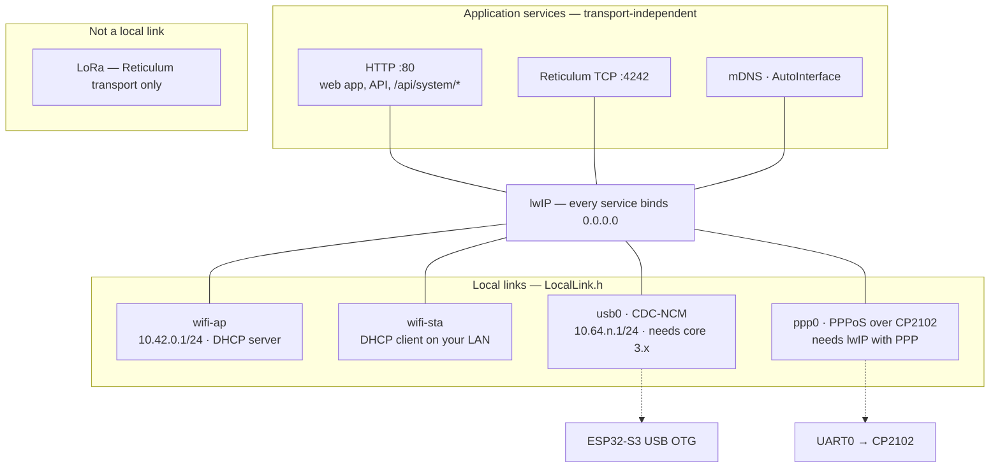

# Local links, the maintenance console and the bootloader manager

A *local link* is a way a host computer reaches the node directly: the Wi-Fi
access point, the station uplink, the chip's own USB carrying IP (CDC-NCM), PPP
over a USB-UART bridge, or a wire in the future. Everything above lwIP — the
web app and API on :80, Reticulum TCP on :4242, mDNS, AutoInterface — binds to
every interface lwIP has and does not know which link a request came over.
That is the whole design; the rest of this page is what it took to make it
true and what remains.

LoRa is not a local link. The radio is a Reticulum transport and nothing here
puts Ethernet or IP on it.



## Board capability matrix

What each PCB puts on its USB connector. This is `boards.json` (`local_link`),
turned into `BOARD_*` build flags by `tools/board_caps.py` at build time and
checked by `tools/check_boards.py` in CI, so the firmware, the release
packager and the flasher never disagree about it.

| Env | MCU | On the USB connector | Bootloader methods, best first | IP local links |
|---|---|---|---|---|
| `t3s3`, `t3s3-sx1280`, `t3s3-sx1280-pa`, `esp32s3-qspi` | ESP32-S3 | the chip's own USB (D+/D− routed): USB-Serial/JTAG today, OTG capable | `auto_reset_dtr_rts`, `manual_recovery` (no software entry: see below) | wifi-ap, wifi-sta; **usb0 hardware-capable, not in this build** |
| `heltec-v3` | ESP32-S3 | CP2102 bridge on UART0 (the S3's own USB is not on the connector) | `software_api`, `auto_reset_dtr_rts`, `manual_recovery` | wifi-ap, wifi-sta; **ppp0 hardware-capable, not in this build** |
| `heltec-ws` | ESP32 | CP2102 bridge on UART0 | `auto_reset_dtr_rts`, `manual_recovery` | wifi-ap, wifi-sta; ppp0 as above |
| `tbeam` | ESP32 | CH9102 bridge on UART0 | `auto_reset_dtr_rts`, `manual_recovery` | wifi-ap, wifi-sta; ppp0 as above |

The `heltec-v3` row is the one to read twice: it is an S3, so its firmware can
put it into the ROM downloader on request, but its USB is a serial bridge, so
there is no USB networking to be had — CDC-NCM is a property of the connector
wiring, not of the chip.

`GET /api/status` reports every link under `local_links` (type, phase,
address, uptime, a client count where the link can tell, and a `reason` where
the board has the hardware but the build lacks the driver).
`GET /api/settings` reports the same three facts per link — `hardware`,
`supported`, `enabled` — so the settings page shows a greyed-out switch with
the reason rather than no switch.

## The maintenance console

Every board's serial port — the S3's USB CDC, the Heltec's CP2102 — now
answers commands as well as printing the log. One request per line; every
reply line begins with `RM `, log lines never do, so a script filters on the
prefix. The full grammar is in `src/MaintenanceProtocol.h`, which is pure and
host-tested.

```
$ python -m serial.tools.miniterm /dev/ttyACM0 115200
VERSION
RM VERSION firmware="RetiMesh Node" version=v0.2.0 board="LilyGO T3-S3" idf=v4.4.7 assets=1a2b3c4d5e6f7a8b
RM OK VERSION
NETWORK_STATUS
RM NETWORK_STATUS link=wifi-ap type=wifi_ap phase=ready ip=10.42.0.1 addressing=static uptime_s=812 clients=1
RM NETWORK_STATUS link=wifi-sta type=wifi_sta phase=disabled ip=- addressing=none uptime_s=0
RM NETWORK_STATUS link=usb0 type=usb_ncm phase=disabled ip=- addressing=none uptime_s=0
RM NETWORK_STATUS link=ppp0 type=ppp_uart phase=disabled ip=- addressing=none uptime_s=0
RM OK NETWORK_STATUS
BOOTLOADER
RM ERR BOOTLOADER 400 add CONFIRM: BOOTLOADER CONFIRM
```

| Command | Reply |
|---|---|
| `HELP` | one `RM HELP cmd=… help="…"` line per command |
| `VERSION` | firmware, version, board, IDF, asset stamp |
| `STATUS` | uptime, boot count, reset reason, heap, radio, transport, whether a restart is pending |
| `USB_STATUS` | how the host is attached, the bootloader methods this board offers |
| `NETWORK_STATUS` | one line per local link |
| `LINKS` | per link: hardware / firmware / enabled, and the reason when it cannot run |
| `WIFI ON` / `WIFI OFF` | saves the link setting and restarts — the way back from a Wi-Fi-off node |
| `RESET CONFIRM` | restart into the application |
| `BOOTLOADER CONFIRM` | restart into the ROM downloader (`501` on a classic ESP32, which cannot) |

Errors are `RM ERR <CMD> <code> <text>` with HTTP-style codes (400, 404, 409,
501). Lines longer than 96 bytes are dropped whole and answered with a 400 —
never truncated into something shorter that might parse. Bytes outside
printable ASCII make a line unusable, so bridge noise at the wrong baud is not
a command. The console can be switched off (`maintenance.console_enabled`);
the log keeps flowing either way.

On the S3's USB-Serial/JTAG port, opening the console does not reset the node:
the tooling opens it with DTR and RTS both asserted, which is the running
state on every board here — both lines high is what the kernel sets on open,
and asking for either low passes through the reset handshake. A terminal program that
asserts them will reset it, which is the same as it always was.

## The bootloader manager

`Bootloader.h` is the one place that restarts the node. Every restart — a
settings save, an SD store move, the console, the HTTP API, and later the USB
touch — is a request with a target (`app` or `bootloader`), a source, and a
delay long enough for the acknowledgement to leave. When the delay passes the
node stops accepting Reticulum TCP connections and settings writes, records its
run length for the boot diagnostics, flushes the console, and restarts. A
bootloader request outranks a pending reboot; a reboot cannot downgrade a
pending bootloader entry that a flashing tool is already waiting on. The rules
are `BootloaderPlan.h`, pure and host-tested.

```mermaid
stateDiagram-v2
  [*] --> Idle
  Idle --> Armed: request(target, source, delay)
  Armed --> Armed: bootloader request replaces a pending reboot
  Armed --> Quiescing: delay elapsed
  Quiescing --> Restarting: refuse new work, Diag::tick, flush
  Restarting --> [*]: esp_restart()
  note right of Restarting
    target = bootloader on S2/S3/C3:
    shutdown handler writes
    RTC_CNTL_FORCE_DOWNLOAD_BOOT
    before the reset
  end note
```

### How the software transition works, and where it does not

ESP32-S2, S3 and C3 have a bit — `FORCE_DOWNLOAD_BOOT` in
`RTC_CNTL_OPTION1_REG` — that the ROM reads after a reset in place of the
strapping pins. Set, the ROM enters its serial downloader exactly as if BOOT
had been held. The firmware writes it from an `esp_register_shutdown_handler`
handler so it is the last thing done before `esp_restart()`; that is the
sequence the Arduino core's own `usb_persist_restart(RESTART_BOOTLOADER)`
uses for its 1200-baud touch, and the register is documented in the S3
technical reference. The bit does not survive the reset: the ROM clears it, so
a power cycle at any point boots the application again. There is no state to
get stuck in.

The downloader that comes up talks on whatever port the ROM uses — the
USB-Serial/JTAG unit (303a:1001, the same device the application shows) on a
native-USB S3, UART0 through the CP2102 on a Heltec V3 — which is why the
same request works on both.

The classic ESP32 (`tbeam`, `heltec-ws`) has no such bit. Its firmware cannot
put it into the downloader; esptool does, through the bridge's DTR/RTS lines
wired to EN and IO0. `POST /api/system/bootloader` answers `501` there and
`BOOTLOADER CONFIRM` answers `RM ERR BOOTLOADER 501`, and the flashing tools
fall through to esptool's own reset, which is what always worked.

**A native-USB S3 (`t3s3` and its variants) answers `501` too**, and this
was learned on the bench rather than read anywhere. Its console is the
chip's own USB-Serial/JTAG unit, and that unit is not reset by the software
reset `esp_restart()` performs: the host keeps its old enumeration while the
ROM downloader comes up behind it expecting a fresh one, and the chip sits
hung — no console, no downloader, no port drop. The RESET button did not
recover it on the bench; only removing power did, so whatever is stuck lives
in a domain EN does not reach. The same unit implements esptool's DTR/RTS handshake in hardware,
which works unaided and is what those boards offer. The software entry
remains for the S3 behind a UART bridge (`heltec-v3`), where the downloader
talks on UART0 and the bridge is untouched by the chip resetting; that path
has not yet been exercised on hardware.

### `POST /api/system/bootloader`

Admin credentials, `{"confirm":"BOOTLOADER"}`, and three guards:

1. `maintenance.bootloader_api` must be on (default on; a deployed relay can
   turn it off and be flashed by hand only).
2. The request must arrive over a **host-facing link** — the access point,
   USB or PPP — unless `maintenance.bootloader_from_lan` is set. The station
   uplink is somebody's LAN, and a relay on it must not take a
   reboot-into-nothing from across it by default. `GET /api/system/bootloader`
   says `allowed_from_here` so a tool can tell before asking.
3. The chip must be able to (`software_entry`), or the answer is `501` with the
   methods that do apply.

On success: `202 {"ok":true,"restart":true,"target":"bootloader",
"method":"software_api","delay_ms":600,"expect":"…","recovery":"…"}`. The reply
leaves first; the node restarts 600 ms later. Nothing about this is reachable
through Reticulum: the API is HTTP on lwIP and the node's Reticulum
destination carries no such request.

`POST /api/system/reboot` with `{"confirm":"REBOOT"}` is the same path with
`target=app`.

### The 1200-baud touch

Not implemented, on purpose. The touch — a host opening the CDC port at 1200
baud and closing it, which is what the Arduino IDE has sent to reset boards
since the Leonardo — needs a CDC-ACM port the firmware owns, so it can see the
line coding. No board has one: the S3 runs its fixed USB-Serial/JTAG
personality, which implements esptool's DTR/RTS handshake in hardware and
never shows the firmware a line coding. A detector with nothing to feed it was
a method the API listed that nothing could perform, and it was removed. It
comes back with the composite device (below), which is the first thing that
can drive it.

What the firmware *does* guarantee about the request path: the shutdown
handler that arms the ROM's download mode is registered when the request is
accepted, not when the restart runs, so a full handler table is a `409` with a
reason rather than a `202` followed by a plain reboot. And a second request
while one is armed keeps the earlier of the two deadlines, so a page that
re-posts on retry cannot push a promised restart out indefinitely.

## Flashing

`pio run -e t3s3 -t upload` now runs `tools/upload_hook.py` around esptool:

```
find the node          the --upload-port, or the one ESP-looking port; several -> say which
ask the console        BOOTLOADER CONFIRM on the port (no credentials, names the board)
  or ask HTTP          POST /api/system/bootloader at $RETIMESH_NODE_URL, if the console is silent
wait for the port      the USB-Serial/JTAG unit drops and returns (bounded, 8 s)
esptool                PlatformIO's own invocation, --before no_reset when the downloader is known up
wait for VERSION       the application announces itself again (20 s) — or the hook says what to press
```

Every step is bounded and every failure is a message, not a hang. When the
board is a classic ESP32, or nothing answers, the hook steps aside and
esptool's DTR/RTS reset runs as it always has. `RETIMESH_NO_AUTO_BOOTLOADER=1`
skips the hand-off. The same mechanics are the CLI's:

```sh
retimesh-flash devices                      # every node on serial ports and at the well-known addresses
retimesh-flash bootloader --port /dev/ttyACM0
retimesh-flash bootloader --ip 10.42.0.1 --password …
retimesh-flash install --board t3s3 --serial 7C:DF:A1:12:34:56
```

Ports are never assumed. A node is identified by what it says (`VERSION` on
the console, `firmware` in `/api/status`), and with several attached the
choice is by USB serial number or path. CP2102 bridges all report serial
`0001`, so on those the `/dev/serial/by-path` name is the only stable handle.

### What the Linux host sees

Native-USB S3 today:

```
/dev/ttyACM0     303a:1001  USB JTAG/serial debug unit   — console + log; ROM downloader after BOOTLOADER
```

Native-USB S3 with the composite device (follow-up):

```
usb0             CDC-NCM     10.64.<n>.2 from the node's DHCP, node at 10.64.<n>.1
/dev/ttyACM0     CDC-ACM     RetiMesh Maintenance — console, 1200-baud touch
```

CP2102 boards:

```
/dev/ttyUSB0     10c4:ea60  CP2102 — console + log; esptool resets through DTR/RTS
ppp0             (follow-up) PPP over that port, node at 10.65.<n>.1
```

## Recovery

Nothing in the design can lock a node out. The bootloader bit is cleared by
the ROM; a failed flash leaves whatever was in flash; a power cycle boots it —
and on a native-USB S3 it has to be a power cycle, not the RESET button, if
the node was ever put into its downloader by software (which the firmware
now refuses to do there, for that reason).
And the settings refuse the one combination that would: switching the serial
console off while no local link is enabled, or the last link off while the
console is off, answers `400` rather than saving — a node in that state could
only be recovered by erasing it.
When the firmware is broken enough that neither the console nor the API
answers:

1. Hold **BOOT** (GPIO 0; the middle button on a T-Beam, PRG on a Heltec).
2. Press **RST** — or plug the USB cable in while holding BOOT.
3. Release BOOT. The ROM downloader is up on the same port the application
   used.
4. `retimesh-flash install --board <env> --port <port>` or
   `esptool.py --chip esp32s3 --port <port> --before no_reset write_flash …`.

A node that stays silent after that has a hardware problem, not a firmware
one.

## Wi-Fi is optional

`links.wifi` off (settings page, `POST /api/settings/links {"wifi":false}`,
or `WIFI OFF` at the console) restarts the node without its access point or
station. The web server and the Reticulum TCP server still start, bound to
every interface, so a USB or PPP link — when a build carries one — serves them
unchanged; the console always does. `WIFI ON` at the console is the way back.
Turning every link off is allowed and the answer says so in words.

## Native USB: the composite device

The design, verified against the silicon and waiting on the toolchain.

```
USB-C
  ├── CDC-NCM   "RetiMesh Network"      interfaces 0-1, IN×2 OUT×1   → lwIP netif usb0
  ├── CDC-ACM   "RetiMesh Maintenance"  interfaces 2-3, IN×2 OUT×1   → the console above, + 1200-baud touch
  └── (bootloader trigger: the touch, or POST /api/system/bootloader over usb0)
```

**Endpoint budget.** TinyUSB's ESP32-S3 port (`dcd_esp32sx.c`) has
`EP_FIFO_NUM 5` with FIFO0 reserved for EP0 — four usable IN endpoints — and
`EP_MAX 7`, six OUT. Two CDC functions need four IN and two OUT: it fits with
**no IN endpoint to spare**. A third function (a second ACM port for logs is
the obvious request) does not fit, and the descriptor that builds the device
should `static_assert` that budget so it fails to compile rather than
enumerating with an interface missing. That header lands with the device; a
design note shipped as firmware source, which is what an earlier version was,
guarded nothing.

**Identity.** Manufacturer `RetiMesh`, product `RetiMesh Node`, serial = the
factory MAC, interface strings as above. The VID:PID is not ours to choose:
Espressif allocates PIDs under 0x303A to open-source projects on request
(github.com/espressif/usb-pids). Until one is granted the header carries
pid.codes' test allocation 1209:0001, flagged `PID_IS_TEST_ALLOCATION`, which
their policy permits for development and forbids for anything shipped. Host
tooling identifies a node by its product string and its `VERSION` reply, never
by the PID alone.

**Addressing.** The node takes `10.64.<n>.1/24` and runs a DHCP server on the
link, as the access point does; `<n>` is the last octet of the node's factory
MAC, so two nodes on one computer land on two subnets without anyone typing
anything. The static fallback (`10.64.<n>.2` for the host) is there for a
network manager that does not ask. IPv4 link-local alone was rejected because
phones and older managers get the probe wrong often enough that a fixed
address beside it is worth having. That rule lands with the NCM driver,
tested.

**Logging.** With the OTG stack owning the USB peripheral the fixed
USB-Serial/JTAG console goes away, and the firmware must not depend on it. The
strategy: the CDC-ACM function carries the maintenance console and the log on
one stream with the `RM ` prefix discipline already in place; the log level is
a build flag as now; crash and boot diagnostics stay in `Diag` (reset reason,
boot count, previous run length in RTC RAM, reported by `/api/status` and
`STATUS`), which never needed a console; and the secondary hardware UART
(`CONFIG_ESP_CONSOLE_UART`, UART0 pins) remains the panic output for anyone
with a probe. An in-memory log ring served by the API is the natural next
sink.

**Why it is not in this build.** The pinned toolchain — `espressif32 ^6.9.0`,
Arduino core 2.0.17 on ESP-IDF 4.4.7 — ships TinyUSB as a prebuilt library
with MSC, DFU, HID, vendor, CDC and MIDI classes and **no NCM, ECM or RNDIS**
(`esp32-hal-tinyusb.h`, `tusb_config.h` in the 4.4 lib-builder). NCM arrives
with the core 3.x lib-builder (`CONFIG_TINYUSB_NCM_ENABLED`, default on) on
ESP-IDF 5, which the official PlatformIO platform does not ship even at 7.0.x;
it needs the pioarduino platform fork. The same core's prebuilt lwIP has
`CONFIG_LWIP_PPP_SUPPORT` off, so PPPoS is in the same position. Two ways
forward, in order of preference:

1. **Move the toolchain** to pioarduino + Arduino core 3.x (IDF 5.x). This is
   the route that also brings WPA3 (`WPA3_SOFTAP_SUPPORTED` already waits on
   IDF 5) and the current `esp_tinyusb`/`tinyusb_net` APIs. It is a
   whole-firmware re-qualification — AsyncTCP, the Wi-Fi driver, RadioLib,
   PSRAM handling — and belongs in its own branch.
2. **Build TinyUSB from source** as a library under core 2.x with
   `ARDUINO_USB_MODE=1` left alone (so the core's own USB code stays out of
   the way), an own `tusb_config.h` with `CFG_TUD_NCM`, and the PHY switched to
   the OTG controller with `usb_phy`/`usb_hal` from IDF 4.4. Feasible, but it
   duplicates a component the core already links and has to be re-done when
   (1) happens anyway.

Either way the pieces that do not depend on the toolchain are done and tested:
the link registry and phase machine, the capability model, the descriptor
budget, the addressing rule, the console protocol the ACM port will speak, the
touch detector, and the bootloader transition the S3 already performs.

## PPP over the bridge UART — follow-up specification

For `heltec-v3`, `heltec-ws`, `tbeam`: PPPoS on UART0 behind the CP2102/CH9102,
as `PppLink` in the same registry, the same `0.0.0.0` services on top.

- **lwIP side:** `esp_netif` PPP (`esp_netif_ppp.h`, present in the SDK
  headers; the library needs `CONFIG_LWIP_PPP_SUPPORT`), server mode with the
  node at `10.65.<n>.1` and the host at `10.65.<n>.2`, `<n>` as for USB.
- **UART task:** core 0, priority below the radio task, reading into a bounded
  ring (`PPP_RX_RING_BYTES`, 4 KB) and dropping on overflow — PPP retransmits
  and the radio must never wait for it. TX from the lwIP output callback with
  a bounded UART queue.
- **Baud:** `settings.links.pppBaud`, qualified per board from
  `boards.json` `uart.qualification` (115200, 230400, 460800, 921600) up to
  `uart.tested_max_baud`; RTS/CTS only where the board says the bridge exposes
  them (none do today).
- **Console coexistence:** the console and the log share UART0 with PPP. PPP
  frames are HDLC-delimited (`0x7E`); the console stays available *until* the
  host opens PPP and comes back when LCP terminates — the host flashing helper
  therefore uses HTTP over ppp0 to request the bootloader, then closes PPP.
- **Host side (Linux first):** `pppd /dev/ttyUSB0 921600 noauth local
  nodetach 10.65.n.2:10.65.n.1` or a NetworkManager serial connection; the
  helper detects the `ppp0` route, POSTs `/api/system/bootloader`, waits for
  the interface to drop, stops pppd, runs esptool on the underlying port, and
  restarts pppd. Documented dependencies: `ppp`, `pyserial`, `esptool`.
- **Bootloader:** `software_api` on the S3 Heltec V3; on the classic-ESP32
  boards the helper closes PPP and lets esptool's DTR/RTS reset do it, which
  the plan already reports.
- **HIL:** `tools/hil_ppp.py` following `hil_bootloader.py`: detect the port,
  bring PPP up, `/api/status`, bootloader API, PPP drop, esptool, PPP restore,
  `/api/status` again.

## Tests

Host (`pio test -e native`, in CI): `test_local_link` (phase machine, address
rules, USB subnet), `test_bootloader` (plan per board, sequencer,
touch detector), `test_maintenance` (parser, malformed and overlong lines,
noise, line assembler, reply format). Host
tooling (`python -m unittest discover -s tools/retimesh-flash/tests`, in CI):
port discovery and selection, the console protocol against a fake port that
interleaves log lines, the hand-off in every outcome, HTTP probing, bounded
waits.

Bench (`.github/workflows/hil.yml`, self-hosted, dispatch only):
`tools/hil_bootloader.py` — console, links, bootloader entry, esptool reaches
the ROM, flash, application returns — plus the existing `tools/hil.py` radio
checks, per board.
